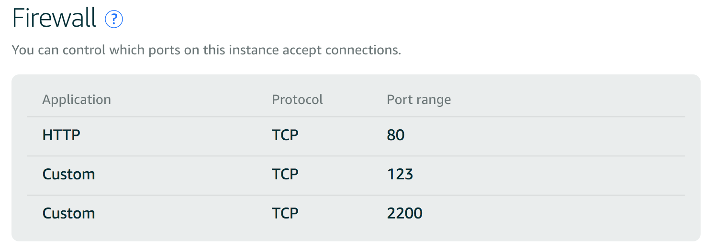

# Linux Deployment

> FUFEI Du

## About

This is the final project for the Udacity Full Stack Nanodegree. This project will deploy catalog app to the AWS Lightsail.

# Server

- **Public IP:** 54.71.70.208
- **Port:** 2200

- http://fufeidu.net

# Software installed
`apt-get -qqy update`  
`apt-get -qqy install python python-pip` 
`pip2 install --upgrade pip`  
`pip2 install flask packaging oauth2client redis passlib flask-httpauth` 
`pip2 install sqlalchemy flask-sqlalchemy psycopg2 bleach` 
`sudo -H pip2 install requests` 
`sudo apt-get install libapache2-mod-wsgi-py3`
# Summary of Configuration
* Create AWS account and login
* Create Lightsail instance
* Bind a static IP to the instance
* From `Account` download the default SSH key
* SSH login to the Ubuntu server
* Setup the firewall to only allow ports: 2200,123,80.  <strong>NOTE: You should also set up the LightSail `NetWroking` like this , otherwise you cannot login using port 2200 even if you set up everything in the server </strong>

* Upload the files to the server's `/var/www/`  or use Github
* Test the server to make sure it runs the same as your local machine
* Don't forget to change your Oauth secret file's redirect URL.
* Setup the `grader` account

# Reference
A Record  
https://support.dnsimple.com/articles/a-record/
 
Ubuntu Fire Wall  
https://help.ubuntu.com/lts/serverguide/firewall.html
 

